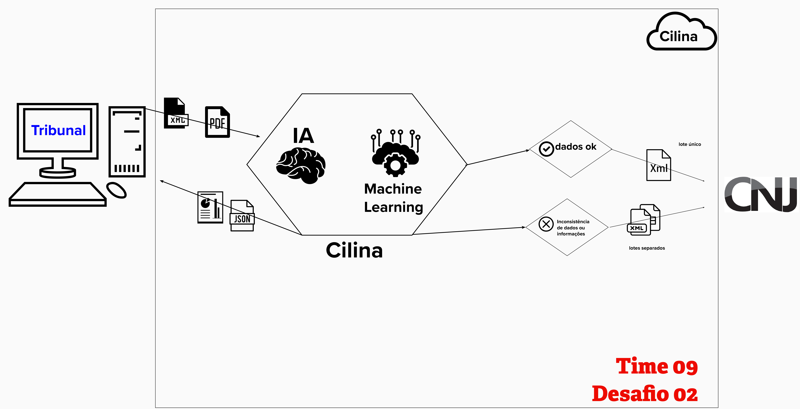
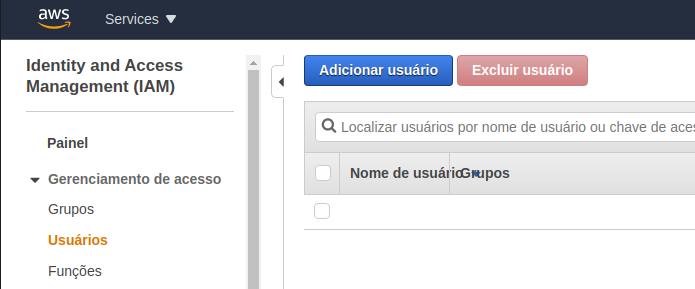
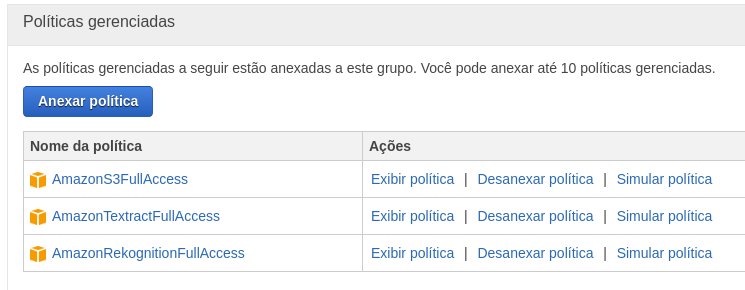

# CILINA

O objetivo desta API é permitir que os tribunais realizar as validação de dados e informações do XML que serão enviados para o serviço REST do Modelo de Transferência de Dados do CNJ. As verificações são realizadas com o uso de Inteligênicia Artificial e Aprendizado de Máquina.

## Arquitetura

**Veja como funciona.**



## Iniciando

**Para começar você precisa de uma conta AWS e criar um user no console da aws : [AWS Console](https://console.aws.amazon.com/) Não se preocupe, a conta pede um cartão de crédito, mas a aplicação não fará nenhuma cobrança.**



**Associe as seguintes permissões**



**Crie uma chave de acesso:**

**Salve como CSV e coloque este arquivo na pasta user_credentials do projeto com o nome new_user_credentials.csv: (user_credentials/new_user_credentials.csv) Copie o 'access key id' e o 'secret access key' e informe no arquivo ocr.py.**


### Pré-requisitos

Instale Python3, Pip3 e AWS CLI em seu ambiente.

### Instalando

Clone este rerpositório para sua máquina:
```
git clone https://github.com/uandisson/cnj-inova-time09.git
```

Rode este comando para instalar as dependências: 

```
pip install -r requirements.txt
```

Iniciar a API: Padrão: http://127.0.0.1:5000/xml

```
python server.py
```

Testar envio de XML para API (também pode utilizar o Postman):

```
python sendXML.py
```


## Desenvolvido com

* [Python](https://www.python.org/) - Base de desenvolvimento
* [AWS Rekognition](https://docs.aws.amazon.com/rekognition/latest/dg/getting-started.html) - API's para reconhecimento de imagens


## Time 
* **09 - Desafio 02**
